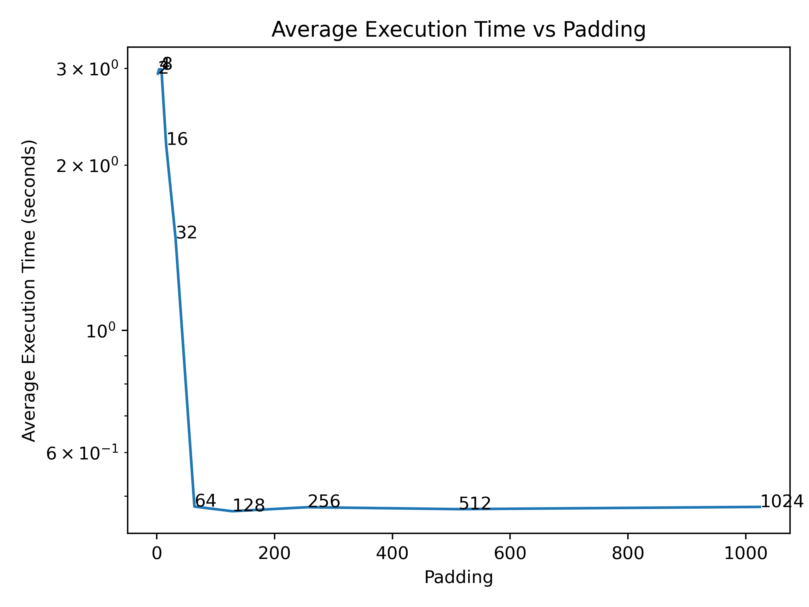

# Exercice 2 - The silent killer

### Question 1 : Préparation du Code et Mesure de Performance Initiale

Pour assurer que chaque thread dispose de sa propre copie des variables de graine (x, y, z) du générateur aléatoire,
nous avons ajouté le mot-clé __thread. Ceci permet d’éviter les interférences entre threads, en fournissant des
variables locales à chaque contexte d’exécution.

### Question 2 : Analyse du Goulot d’Étranglement et Optimisation

le "bottleneck" potentiel dans results_array est principalement dû à la contention de cache entre les threads. Les
quatre résultats sont stockés de manière contiguë, sans séparation entre eux, ce qui augmente les chances que plusieurs
threads accèdent à la même ligne de cache, entraînant des coûts de synchronisation cachés.

Pour pailier a ce bottleneck, on peut rajouter du padding entre les éléments du tableau pour les séparer dans la
mémoire. Cela permettra de réduire la contention de cache, et donc d'améliorer les performances. En effet, sur mon
ordinateur, en ajoutant du padding de 64 octets entre chaque élément du tableau, j'ai pu réduire de 100 fois le temps d'
exécution de l'application.

En modifiant les arguments d'optimisation du compilateur, on remarque que le compilateur ajoute automatiquement du
padding entre les éléments du tableau.

### Question 3 : Mesure de Performance Finale

On remarque les performances augmentent de manière significative en ajoutant du padding de plus de 64 octets entre les
éléments du tableau. En effet, en ajoutant 64 octets de padding, on obtient une amélioration de 100 fois les
performances. En effet la taille d'une ligne de cache sur mon CPU est de 64 octets, donc en ajoutant 64 octets de
padding
entre les éléments du tableau, on s'assure que chaque élément est stocké dans une ligne de cache différente, ce qui
permet d'éviter les coûts de synchronisation cachés.

